# CRA Backend Engine — Sequential Flow

This document describes the sequential flow of the CRA (Compliance Risk Assessment) backend engine from request to response.

## Flow diagram

```mermaid
flowchart TD
  Start["POST /api/cra/calculate"]
  Validate["Validate body: input required"]
  BadReq["400 Bad Request"]
  LoadConfig["Use config from body or DEFAULT_CRA_ENGINE_CONFIG"]
  LoadScorecards["Load scorecards (geography, industry, entity, product, delivery)"]
  GeoScore["Component score: geo (country_code/domicile → scorecard or default)"]
  IndScore["Component score: ind (industry_code/SIC → scorecard or default)"]
  EntScore["Component score: ent (entity_type → scorecard or default)"]
  ProdScore["Component score: prod (product_type → scorecard or default)"]
  DelivScore["Component score: deliv (delivery channels → max from scorecard or default)"]
  NormalizeWeights["Normalize weights to sum = 1 (or equal 0.2 each if sum ≤ 0)"]
  PreOverride["Pre-override score S = clamp(round(Σ weight[c] × score[c]), 1, 5)"]
  GeoCheck{"Geography prohibited?\n(country in prohibited list\nor geography_prohibited = true)"}
  SetGeo5["final_score = 5\noverride_applied = Geography - Prohibited\nfindings += override"]
  SortOverrides["Sort override rules by priority (asc)"]
  LoopOverrides["For each override in order"]
  CondMatch{"Override condition\nmatches input?"}
  SetOverride["final_score = clamp(override.resultScore, 1, 5)\noverride_applied = rule.name\nfindings += override\nbreak"]
  NextOverride["Next override"]
  BuildFindings["Build findings: sanctions, PEP, geography, non-UK jurisdiction"]
  MapRiskBand["risk_band = first band where band.min ≤ final_score ≤ band.max"]
  BuildOutput["Build CRAOutput: record_id, entity_name, final_score, risk_band, pre_override_score, override_applied, findings"]
  Return["200 JSON CRAOutput"]
  Err["500 Internal Server Error"]

  Start --> Validate
  Validate -->|invalid| BadReq
  Validate -->|valid| LoadConfig
  LoadConfig --> LoadScorecards
  LoadScorecards --> GeoScore --> IndScore --> EntScore --> ProdScore --> DelivScore
  DelivScore --> NormalizeWeights
  NormalizeWeights --> PreOverride
  PreOverride --> GeoCheck
  GeoCheck -->|yes| SetGeo5 --> BuildFindings
  GeoCheck -->|no| SortOverrides
  SortOverrides --> LoopOverrides
  LoopOverrides --> CondMatch
  CondMatch -->|yes| SetOverride --> BuildFindings
  CondMatch -->|no| NextOverride
  NextOverride -->|next rule| CondMatch
  NextOverride -->|no more rules| BuildFindings
  SetOverride --> BuildFindings
  BuildFindings --> MapRiskBand
  MapRiskBand --> BuildOutput
  BuildOutput --> Return
  Validate --> Err
  LoadConfig --> Err
```

## Step-by-step summary

| Step | Description |
|------|-------------|
| 1 | **Request** — API receives `POST /api/cra/calculate` with body `{ input: CRAInput, config?: CRAEngineConfig }`. |
| 2 | **Validate** — Ensure `input` is present and is an object; otherwise return 400. |
| 3 | **Config** — Use `config` from body or `DEFAULT_CRA_ENGINE_CONFIG`. |
| 4 | **Scorecards** — Load (cached) scorecards: geography, industry, entity, product, delivery (JSON key → score 1–5). |
| 5 | **Component scores** — For each pillar (geo, ind, ent, prod, deliv), lookup in scorecard by input field(s); if missing, use `componentDefaults`. Each score in [1, 5]. |
| 6 | **Normalize weights** — Weights from config are normalized so they sum to 1 (or equal 0.2 each if sum ≤ 0). |
| 7 | **Pre-override score** — `S = clamp(round(Σ normalized_weight[c] × component_score[c]), 1, 5)`. |
| 8 | **Geography first** — If geography is prohibited (country in `prohibitedCountries` or `input.geography_prohibited === true`): set `final_score = 5`, `override_applied = "Geography - Prohibited"`, then skip to step 11. |
| 9 | **Overrides** — Else: sort override rules by `priority` (asc). For each rule in order: if `checkOverride(input, rule)` is true, set `final_score = clamp(rule.resultScore, 1, 5)`, set `override_applied = rule.name`, push finding, then **break** (first match wins). |
| 10 | **Findings** — Append to findings: sanctions match, PEP count, prohibited geography, non-UK jurisdiction, etc. |
| 11 | **Risk band** — `risk_band` = first band in config (sorted by min) where `band.min ≤ final_score ≤ band.max`. |
| 12 | **Response** — Build `CRAOutput` (record_id, entity_name, final_score, risk_band, pre_override_score, override_applied, findings) and return 200 JSON. |

## Override condition types (backend)

- **geography_prohibited** — Country in prohibited list or `geography_prohibited === true`.
- **sanctions** — `sanction_match === true` or `sanction_likelihood >= 99`.
- **pep_am** — `pep_count > 0` or `has_pep` or `has_adverse_media`.
- **shell_company** — `has_employees === false` and `has_premises === false` and `has_cais === false` and `has_pp === false`.
- **industry_cbd** — SIC in CBD/cannabis set or industry_description matches cannabis/CBD keywords.
- **industry_crypto** — industry_description contains "crypto" or "cryptocurrency".
- **bearer_shares** — `bearer_shares === true`.
- **adult_entertainment** — SIC in adult-entertainment SIC set.

## Files

- **API entry:** `server/index.ts` — POST /api/cra/calculate, GET /api/health.
- **Engine:** `server/craEngine.ts` — `calculateCRA(input, config)`.
- **Scorecards:** `server/scorecards/*.json` — Loaded by `server/loadScorecards.ts`.
